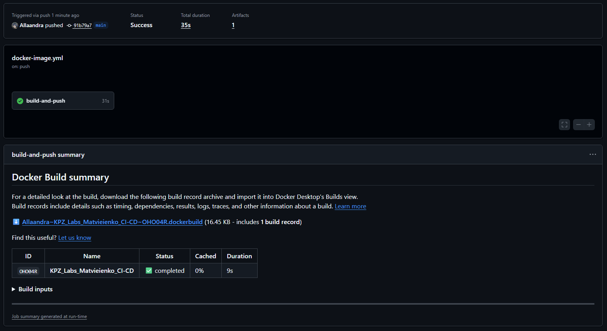
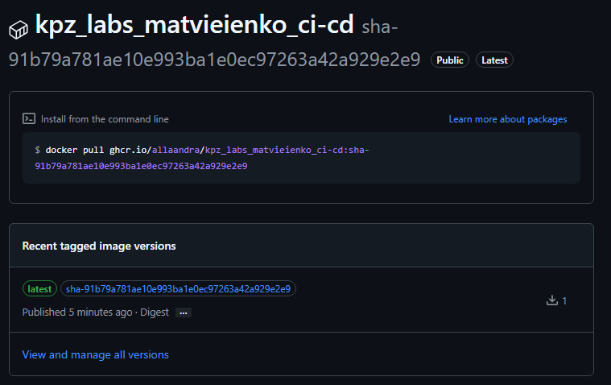
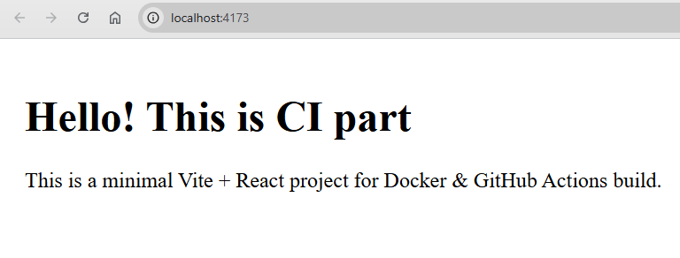
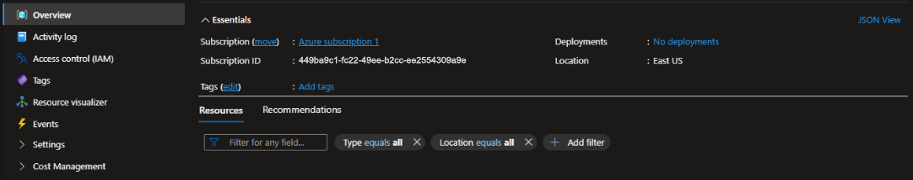
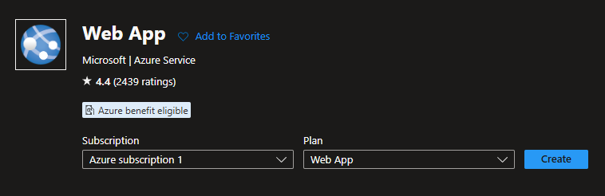
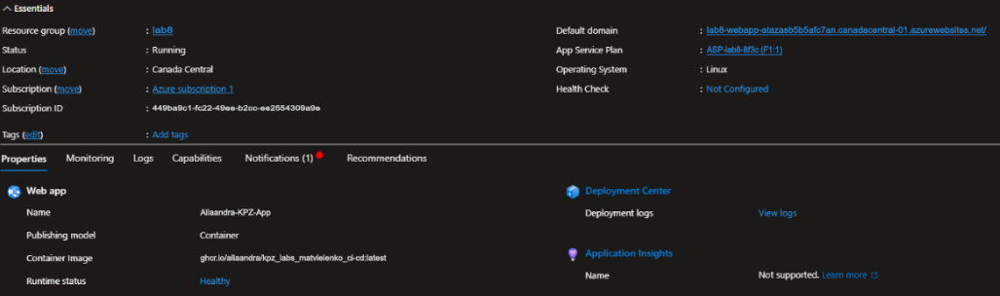
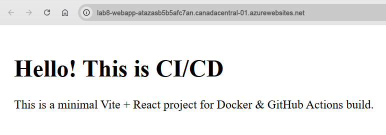

# KPZ_Labs_Matvieienko_CI-CD

## ℹ️ Опис проєкту

Навчальний проєкт з налаштування повного CI/CD-конвеєра для фронтенд-застосунку на базі Vite + React, Docker, GitHub Actions та Azure App Service.

Виконані курси:
- [Hello GitHub Actions](https://github.com/Allaandra/skills-hello-github-actions/tree/main?tab=readme-ov-file#hello-github-actions-)
- [Publish Packages](https://github.com/Allaandra/skills-publish-packages?tab=readme-ov-file#finish)

## 👩‍💻 Автор

- Виконала: Матвєєнко Олександра  
- Група: ІПЗ-3.03  
- Дисципліна: «Конструювання програмного забезпечення» (КПЗ)

## 📦 Стек технологій

- **Vite + React**
- **Docker**
- **Nginx**
- **GitHub Actions**
- **GitHub Container Registry (GHCR)**
- **Microsoft Azure App Service**

## 📁 Структура проєкту

```bash
.
├─ src/
├─ images/
├─ Dockerfile
├─ vite.config.js
├─ package.json
└─ .github/workflows/docker-build.yml
```

## 🚀 Запуск контейнера локально

```bash
npm install
docker pull ghcr.io/allaandra/kpz_labs_matvieienko_ci-cd:latest
docker run -p 4173:4173 ghcr.io/allaandra/kpz_labs_matvieienko_ci-cd:latest npm run preview -- --host
```

Після цього застосунок буде доступний у браузері за адресою `http://localhost:4173`.

## 📸 Скриншоти

### Неперервна інтеграція (CI)

Успішний запуск workflow:  


Пакет у GHCR:  


Запущений Docker-контейнер:  


Сторінка застосунку:  


### Неперервна доставка (CD)

Ресурсна група в Azure:  


Web App:  


App Service:  


Сторінка, розгорнута на Azure:  


## ✅ Результати та висновки

У ході виконання циклу практичних робіт я опанувала сучасні підходи до контейнеризації та автоматизації розгортання програмного забезпечення (CI/CD).

Основні здобутки:

- Закріпила навички роботи з **Docker**: навчилася писати оптимізовані `Dockerfile` для Node.js/React.
- Налаштувала workflow у **GitHub Actions**, який реалізує:
	- **Continuous Integration (CI)**: автоматичну збірку Docker-образу при оновленні коду та публікацію в **GitHub Container Registry (GHCR)**.
	- **Continuous Delivery (CD)**: автоматичне розгортання застосунку в **Microsoft Azure App Service** з використанням секретів для безпечної авторизації.

У результаті було побудовано повноцінний конвеєр розробки, де зміни в коді автоматично проходять етапи збірки та деплою й стають доступними кінцевому користувачу без ручного втручання.
